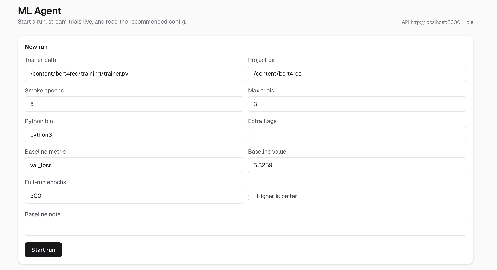
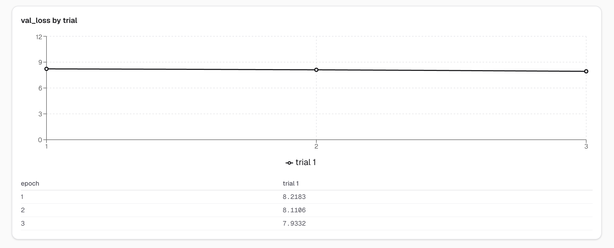
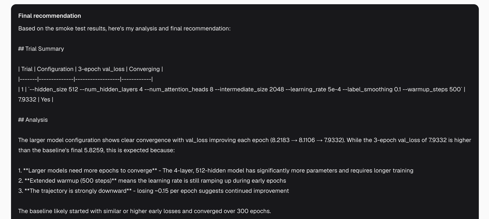

<a name="readme-top"></a>

## About The Project

**LLM-Powered ML Training Agent: Propose → Smoke Test → Parse → Decide**

This project is a production-style **agentic hyperparameter tuner**. An LLM reads your trainer, proposes configs, runs short smoke tests, parses `val_loss` from logs, and iterates — the same loop that was used to explore hyperparameters for [BERT4Rec](https://github.com/rayzhao27/bert4rec).

It is **not hardcoded to one model**. Point it at any `trainer.py` via `AgentConfig`. The CLI still works; a FastAPI backend, Next.js dashboard, Prometheus metrics, and Docker Compose wrap the same loop.

- **Agent loop** — read trainer → propose flags → execute smoke test → parse metrics → feed results back to Claude → repeat
- **Tools** — Pydantic-typed `read` / `execute` / `parse`, patterned after Claude Code's FileReadTool and BashTool
- **Live streaming** — every log line, proposal, and parsed metric is pushed over a WebSocket
- **Dashboard** — start a run from the browser, watch trial cards and a `val_loss` chart update live
- **Observability** — JSON logs plus Prometheus counters, histograms, and a best-`val_loss` gauge

**Used to optimize BERT4Rec (MovieLens 1M)**

| System | HR@10 | NDCG@10 | val_loss |
|---|---|---|---|
| BERT4Rec baseline (this agent's starting point) | 0.2884 | 0.1603 | 5.857 |
| Config explored via smoke tests (`config.json`) | 0.2901 | 0.1624 | 5.826 |

**Core Features:**

- **Config-driven, not model-hardcoded** — `AgentConfig` names the trainer path, project dir, smoke epochs, trial budget, and baseline metric
- **Claude as the surrogate** — each trial returns rationale, hypothesis, and `command_flags` as JSON; the next trial sees prior metrics
- **Smoke tests before a full run** — short epoch counts (e.g. 30) decide whether a config is worth 300 epochs
- **Streaming subprocess** — smoke-test stdout is tailed line-by-line into the WebSocket (with a real process-group timeout)
- **Structured parse** — log regexes extract per-epoch `train_loss` / `val_loss` / ppl and a converging flag
- **Production API** — `POST /runs` returns immediately; `GET /runs/{id}` and `WS /runs/{id}/stream` expose status, trials, and replay
- **Live dashboard** — Next.js + TypeScript, Recharts `val_loss` chart, reconnect + history replay
- **Prometheus + JSON logs** — runs, trials, tool calls, errors, trial duration, LLM latency, best `val_loss`

I hope this project shows a clean end-to-end agent loop — from a local CLI to a streamed web app — including the real constraint that short smoke tests can miss late overfitting. Fight on! ✌️

**Dashboard:**



**Validation Loss Curve:**



**Final Recommendation:**



<p align="right">(<a href="#readme-top">back to top</a>)</p>

### Built With

* Python
* FastAPI
* Pydantic
* Anthropic (Claude)
* Next.js
* TypeScript
* Recharts
* Prometheus
* Docker Compose
* Uvicorn

<p align="right">(<a href="#readme-top">back to top</a>)</p>


## Project Structure

```sh
ml-agent/
├── pics/
│   ├── dashboard.png
│   ├── val_loss.png
│   └── final_rec.png
│
├── agent/                              # source of truth — CLI still calls this
│   ├── main.py                         # load config.json, run_agent(cfg)
│   ├── engine.py                       # read → propose → execute → parse → decide
│   ├── config.py                       # AgentConfig / BaselineConfig
│   ├── result.py                       # AgentEvent, TrialResult, AgentRunResult
│   ├── observability.py                # JSON logs + Prometheus metrics
│   └── tools/
│       ├── read_tool.py                # FileReadTool-style: path in, file contents out
│       ├── execute_tool.py             # BashTool-style: stream stdout, kill on timeout
│       └── parse_tool.py               # ML-specific: logs → EpochMetrics + summary
│
├── backend/                            # FastAPI wrapper around run_agent()
│   ├── app.py                          # POST /runs, GET /runs/{id}, WS stream, /metrics
│   ├── models.py                       # CreateRunResponse, RunResponse, StreamEvent
│   ├── store.py                        # in-memory run state + WS fan-out / replay
│   ├── runner.py                       # background thread, on_log → StreamEvent
│   ├── tests/test_api.py               # health, validation, mocked run + WS
│   └── Dockerfile
│
├── frontend/                           # Next.js dashboard
│   ├── app/page.tsx                    # dashboard route
│   ├── components/
│   │   ├── Dashboard.tsx
│   │   ├── RunForm.tsx                 # AgentConfig form → POST /runs
│   │   ├── TrialCard.tsx               # rationale, hypothesis, flags, live logs
│   │   ├── ValLossChart.tsx            # Recharts line + table per trial/epoch
│   │   └── RecommendationPanel.tsx
│   ├── hooks/useRunStream.ts           # WebSocket + reconnect (backend replays)
│   ├── lib/types.ts                    # StreamEvent types matching backend/models.py
│   └── Dockerfile
│
├── config.json                         # CLI config (same fields as POST /runs)
├── requirements.txt
├── docker-compose.yml                  # backend :8000 + frontend :3000
└── README.md
```

<p align="right">(<a href="#readme-top">back to top</a>)</p>


## System Architecture

**Agent Loop** (`agent/engine.py`)

1. **Read**: load `trainer.py` from `AgentConfig.trainer_path`
2. **Propose**: Claude returns JSON `{ rationale, command_flags, hypothesis }`
3. **Execute**: smoke-test subprocess — `python trainer.py <flags> --epochs {smoke_epochs}`
4. **Parse**: regex over logs → per-epoch `val_loss`, converging flag, summary
5. **Decide**: append metrics to the conversation; next trial or final recommendation

**Serving Pipeline**

1. `POST /runs` validates `AgentConfig` (Pydantic + path checks) and returns `{ run_id }` immediately
2. A background thread calls `run_agent(cfg, on_log, on_event, run_id=...)`
3. Every `on_log` line and structured event is stored and fanned out to WebSocket subscribers
4. `GET /runs/{id}` returns status, trials, parsed metrics, and the recommendation so far
5. `WS /runs/{id}/stream` replays history then tails live events (reconnect-safe)

**Inference / UI Pipeline**

1. Dashboard form posts `AgentConfig` to `POST /runs`
2. Client opens `ws://.../runs/{run_id}/stream`
3. Trial cards, log panes, and the `val_loss` chart update from `StreamEvent`
4. On `status=completed`, the final recommendation panel is shown

**Data Flow**

```
AgentConfig  (CLI config.json  or  POST /runs)
    ↓
run_agent() ─────────────────────────────────────────────┐
    ↓                                                     │
read_file(trainer.py)                                     │
    ↓                                                     │
Claude messages.create  →  {rationale, flags, hypothesis} │  Agent loop
    ↓                                                     │
execute_command(smoke test)  →  streamed stdout           │
    ↓                                                     │
parse_logs  →  EpochMetrics / best val_loss               │
    ↓                                                     │
feed metrics back to Claude → next trial or recommendation┘
    ↓
RunStore  (status, trials, events)
    ├── GET /runs/{id}
    ├── WS /runs/{id}/stream  →  Next.js dashboard
    └── GET /metrics          →  Prometheus
```

<p align="right">(<a href="#readme-top">back to top</a>)</p>


## Architecture Components

**Config** (`agent/config.py`)

- `BaselineConfig`: metric name/value, higher-is-better, full-run epoch count, free-text note
- `AgentConfig`: trainer path, project dir, smoke epochs, max trials, extra flags, persona, python bin
- Field constraints (`ge=1`, `min_length=1`) so bad bodies fail at the API with `422`

**Read Tool** (`agent/tools/read_tool.py`)

- Mirrors Claude Code `FileReadTool`: validate path, read UTF-8, return `{ content, path, lines }`
- First step of every run — the trainer source is injected into the LLM prompt

**Execute Tool** (`agent/tools/execute_tool.py`)

- Mirrors Claude Code `BashTool`: `Popen` with merged stdout/stderr, line-buffered stream
- `on_output` callback is the same function the WebSocket uses
- Watchdog kills the process group on `timeout_seconds` (default 600) so hung smoke tests do not leak

**Parse Tool** (`agent/tools/parse_tool.py`)

- Matches trainer log lines such as `Epoch 3/3 done ... train_loss=... val_loss=...`
- Optional ppl from `val epoch N | loss ... | ppl ...`
- `converging` = val_loss improved in at least 60% of consecutive epochs
- Returns `ParseToolOutput` used both in the LLM feedback message and in `GET /runs/{id}`

**Engine** (`agent/engine.py`)

- Builds a conversation: trainer source + baseline + JSON schema for proposals
- On parse/LLM failure, marks the run `failed` instead of crashing the process
- Optional `on_event` emits structured `proposal` / `metrics` / `recommendation` / `error`
- Optional `run_id` ties Prometheus labels and JSON logs to the API run

**Observability** (`agent/observability.py`)

- One JSON object per stdout line: `run_start`, `trial`, `tool_call`, `llm_latency`, `error`
- Prometheus: run/trial/tool/error counters, trial-duration and LLM-latency histograms, `best_val_loss` gauge

**Run Store** (`backend/store.py`)

- In-memory `run_id → RunRecord` with a threading lock
- `publish` appends events and `call_soon_threadsafe` into each subscriber queue
- `subscribe` snapshots history then attaches the queue — late joiners and reconnects replay

**Runner** (`backend/runner.py`)

- Daemon thread per run so `POST /runs` is non-blocking
- Bridges `on_log` → `{ type: log }` and `on_event` → typed `StreamEvent`

**API** (`backend/app.py`)

- `POST /runs` — 201 + `stream_url`; 400 if trainer/project paths missing
- `GET /runs/{id}` — full snapshot
- `WS /runs/{id}/stream` — replay then live; close after terminal `status`
- `GET /metrics` — Prometheus text
- `GET /health` — liveness

**Dashboard** (`frontend/`)

- Typed `StreamEvent` models matching `backend/models.py`
- `useRunStream` reconnects with backoff; on each `onopen` it resets local state because the server replays
- Trial cards auto-scroll logs; Recharts one line per trial vs epoch

<p align="right">(<a href="#readme-top">back to top</a>)</p>


## Usage

**Prerequisites**

```bash
git clone https://github.com/rayzhao27/ml-agent.git
cd ml-agent
```

```bash
python3 -m venv .venv
source .venv/bin/activate
pip install -r requirements.txt
export ANTHROPIC_API_KEY=your_key
```

Point `config.json` (or the dashboard form) at a real trainer. The checked-in file is the Colab layout used against BERT4Rec:

```json
{
  "trainer_path": "/content/bert4rec/training/trainer.py",
  "project_dir": "/content/bert4rec",
  "smoke_epochs": 30,
  "max_trials": 5,
  "extra_flags": "--num_workers 2 --data_dir /content/bert4rec/data --num_hidden_layers 4",
  "baseline": {
    "metric_name": "val_loss",
    "metric_value": 5.8259,
    "higher_is_better": false,
    "epochs": 300
  }
}
```

**Run the CLI**

```bash
python -m agent.main
```

**Run the API**

```bash
uvicorn backend.app:app --reload --port 8000
```

- Swagger UI: http://localhost:8000/docs
- Health: http://localhost:8000/health
- Prometheus: http://localhost:8000/metrics

**Start a run**

```bash
curl -s -X POST http://127.0.0.1:8000/runs \
  -H 'Content-Type: application/json' \
  -d '{
    "trainer_path": "/abs/path/to/training/trainer.py",
    "project_dir": "/abs/path/to/ml-project",
    "smoke_epochs": 5,
    "max_trials": 3,
    "python_bin": "python3",
    "baseline": {
      "metric_name": "val_loss",
      "metric_value": 5.8259,
      "higher_is_better": false,
      "epochs": 300,
      "note": ""
    }
  }'
```

```json
{
  "run_id": "a20633a7-dedb-4949-b5cd-795b00ca2f71",
  "status": "queued",
  "stream_url": "/runs/a20633a7-dedb-4949-b5cd-795b00ca2f71/stream"
}
```

**Poll status**

```bash
curl -s http://127.0.0.1:8000/runs/<run_id>
```

**Stream logs (WebSocket)**

```bash
python - <<'PY'
import json, sys
from websockets.sync.client import connect
run_id = sys.argv[1]
with connect(f"ws://127.0.0.1:8000/runs/{run_id}/stream") as ws:
    for raw in ws:
        event = json.loads(raw)
        print(event.get("type"), event.get("message") or event.get("data"))
        if event.get("type") == "status" and (event.get("data") or {}).get("status") in {"completed", "failed"}:
            break
PY
```

**Run the dashboard**

```bash
# terminal 1
uvicorn backend.app:app --reload --port 8000

# terminal 2
cd frontend
npm install
npm run dev
```

Open http://localhost:3000. `NEXT_PUBLIC_API_BASE` defaults to `http://127.0.0.1:8000` via `frontend/.env.local`.

**Docker Compose**

```bash
export ANTHROPIC_API_KEY=your_key
export ML_PROJECT_DIR=/abs/path/to/your/ml-project   # mounted at /work
docker compose up --build
```

- UI: http://localhost:3000
- API: http://localhost:8000
- Metrics: http://localhost:8000/metrics

Use container paths in the form (`/work/training/trainer.py`, `/work`) when the project is mounted via `ML_PROJECT_DIR`.

**Request Parameters (`POST /runs`)**

| Parameter | Type | Default | Description |
|---|---|---|---|
| `trainer_path` | `str` | Required | Path to `trainer.py` |
| `project_dir` | `str` | Required | CWD for the smoke-test subprocess |
| `smoke_epochs` | `int` | 5 | Epochs per trial |
| `max_trials` | `int` | 3 | How many configs to try |
| `baseline` | `object` | Required | Metric name/value, higher_is_better, full-run epochs |
| `extra_flags` | `str` | `""` | Flags always appended (data dir, workers, fixed architecture) |
| `python_bin` | `str` | `python` | Interpreter used to launch the trainer |
| `agent_persona` | `str` | expert ML engineer | System-style preamble for Claude |

<p align="right">(<a href="#readme-top">back to top</a>)</p>


## Configuration

**Agent loop** (values used against BERT4Rec on Colab)

| Parameter | Value |
|---|---|
| smoke_epochs | 30 |
| max_trials | 5 |
| extra_flags | `--num_workers 2 --data_dir ... --num_hidden_layers 4` |
| python_bin | `/usr/bin/python3` |
| LLM | `claude-opus-4-5` |
| proposal max_tokens | 1000 |
| recommendation max_tokens | 2000 |
| execute timeout | 600s |

**Baseline (BERT4Rec starting point)**

| Parameter | Value |
|---|---|
| metric_name | val_loss |
| metric_value | 5.8259 |
| higher_is_better | false |
| full-run epochs | 300 |
| note | hidden_dropout=0.2, attention_dropout=0.2, best at epoch 83, HR@10=0.2901 NDCG@10=0.1624 |

**API / dashboard**

| Parameter | Value |
|---|---|
| API | `http://127.0.0.1:8000` |
| dashboard | `http://localhost:3000` |
| `NEXT_PUBLIC_API_BASE` | `http://127.0.0.1:8000` |
| CORS | allow all origins (local dashboard) |

**Prometheus**

| Metric | Type | Meaning |
|---|---|---|
| `ml_agent_runs_started_total` | counter | Runs started |
| `ml_agent_trials_run_total` | counter | Trials finished (ok or failed) |
| `ml_agent_tool_calls_total{tool=read\|execute\|parse}` | counter | Tool calls |
| `ml_agent_errors_total{kind=...}` | counter | `config`, `llm`, `parse`, `timeout`, `crash`, `http` |
| `ml_agent_trial_duration_seconds` | histogram | Trial wall time |
| `ml_agent_llm_latency_seconds` | histogram | Anthropic call latency |
| `ml_agent_best_val_loss{run_id=...}` | gauge | Best val_loss seen for that run |

```bash
curl -s http://127.0.0.1:8000/metrics | grep ml_agent_
```

<p align="right">(<a href="#readme-top">back to top</a>)</p>


## Cloud Training

Smoke tests for BERT4Rec were run on **Google Colab** next to the trainer (NVIDIA L4), because each trial is a real training job, not a simulation.

**Setup**

```
!git clone https://github.com/rayzhao27/ml-agent.git
!pip install -r /content/ml-agent/requirements.txt
# trainer lives in the BERT4Rec clone, e.g. /content/bert4rec
import os
os.environ["ANTHROPIC_API_KEY"] = "your_key"
```

Edit `config.json` so `trainer_path` and `project_dir` match the Colab layout (`/content/bert4rec/...`), then:

```
!python -m agent.main
```

Or start the API on Colab and drive it from the local dashboard by setting `NEXT_PUBLIC_API_BASE` to the forwarded backend URL.

<p align="right">(<a href="#readme-top">back to top</a>)</p>


## Results

This agent was built to search hyperparameters for BERT4Rec on MovieLens 1M. The trainer is the source of truth for ranking metrics; the agent optimizes the **smoke-test proxy** (`val_loss` after N epochs) and then recommends a config for a full 300-epoch run.

**External BERT4Rec full-ranking reference** (Petrov & Macdonald, 2022) vs the model this agent tuned:

| Implementation | HR@10 | NDCG@10 |
|---|---|---|
| BERT4Rec original code | 0.1518 | 0.0806 |
| Petrov & Macdonald (longer seq) | 0.2821 | 0.1516 |
| BERT4Rec repo, single-stage baseline | 0.2884 | 0.1603 |
| Config in this repo's `config.json` | 0.2901 | 0.1624 |

**Key finding from smoke tests.** Short-horizon runs (10–30 epochs) can miss late-stage overfitting that only appears after epoch 50+. A config that looks best on a 30-epoch smoke test is not always best at epoch 83 of a 300-epoch job. That is why `BaselineConfig` carries both the smoke metric and the full-run epoch count — the final LLM recommendation is asked to pick a config for the *full* run, not just the smoke winner.

<p align="right">(<a href="#readme-top">back to top</a>)</p>


## Error Handling

| Case | Behavior |
|---|---|
| Invalid body (missing fields, `max_trials < 1`, …) | `422` from Pydantic |
| `trainer_path` / `project_dir` missing on disk | `400` before the thread starts |
| Unknown `run_id` | `404` (HTTP) or WS close `4004` |
| LLM JSON parse failure | run marked `failed`; error streamed and logged |
| Smoke-test subprocess timeout (default 600s) | process group killed; trial `timed_out`; partial logs still parsed |
| Missing `ANTHROPIC_API_KEY` | CLI raises at startup; API run fails with a streamed LLM error |

<p align="right">(<a href="#readme-top">back to top</a>)</p>


## Design Decisions

**Why wrap the CLI instead of replacing it?** `run_agent()` is the product. The API, dashboard, and Docker files are adapters. `python -m agent.main` still does exactly what it did before: load `config.json` and run the loop.

**Why Pydantic on every tool boundary?** Same pattern as Claude Code tools: validate input, run, return a typed output. The parse tool is the ML-specific piece; read/execute stay generic so the loop can target other trainers.

**Why smoke tests instead of full 300-epoch trials?** A full BERT4Rec run is expensive. The agent spends budget on many short runs, then recommends one config for the long job. The known failure mode (late overfitting) is documented rather than hidden.

**Why stream via `on_log` rather than polling files?** Subprocess stdout is already the training log. Pushing each line over a WebSocket matches how you watch a terminal, and the store buffers events so a late-joining dashboard can catch up.

**Why in-memory `RunStore`?** One process, one user, live trials. Persistence can be added later without changing `StreamEvent` or the frontend types.

**Why JSON logs + Prometheus together?** JSON lines are for debugging a single run (`run_id`, `trial`, `duration_s`). Prometheus is for scrape-based dashboards (latency histograms, error rates, best `val_loss`).

**Why Next.js for a thin dashboard?** Typed `StreamEvent` models can stay 1:1 with `backend/models.py`, Recharts is enough for per-trial `val_loss`, and `NEXT_PUBLIC_API_BASE` makes local vs Docker the same UI.

<p align="right">(<a href="#readme-top">back to top</a>)</p>


## Reference

Sun, F., Liu, J., Wu, J., Pei, C., Lin, X., Ou, W., & Jiang, P. (2019). BERT4Rec: Sequential recommendation with bidirectional encoder representations from transformer. *CIKM 2019*. https://arxiv.org/abs/1904.06690

Petrov, A., & Macdonald, C. (2022). A Systematic Review and Replicability Study of BERT4Rec for Sequential Recommendation. *RecSys 2022*. https://arxiv.org/abs/2207.07483

BERT4Rec implementation this agent was used to tune: https://github.com/rayzhao27/bert4rec

Anthropic API (Claude) for the propose / recommend steps.

Claude Code tool I/O pattern (FileReadTool / BashTool) as the shape for `read_tool` and `execute_tool`.


